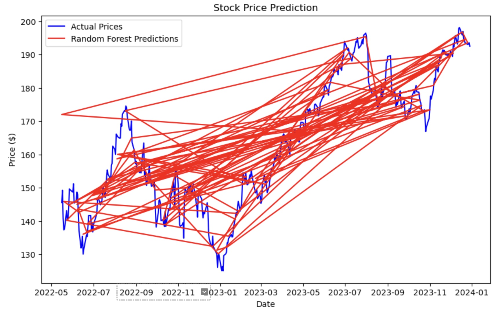
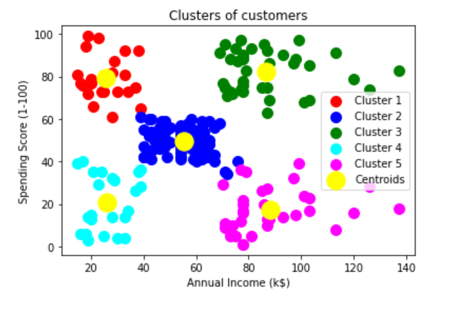
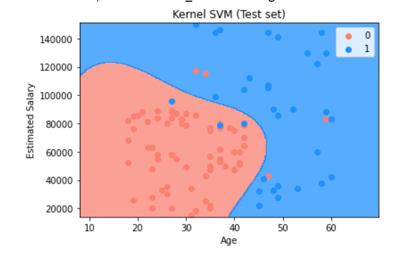
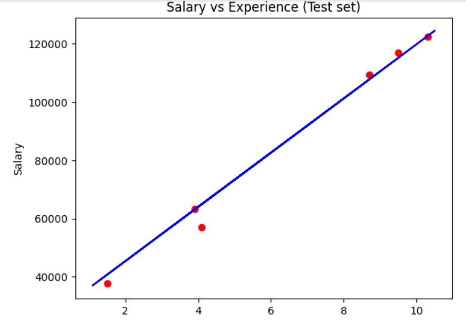

# MachineLearningProjects

### [Project_1:Customer_Categorization](https://github.com/PRANAVKUMAR183/Customer_Categorization) (Link to project)

*Developed a machine learning model using Python to predict Apple stock prices based on historical data for improved investment decisions.Using 50-day moving average and 200-day moving aveerage.

**Key Techniques Used**: Random_Forest_Regression,Stock Analysis

**Outcome**: Evaluated model performance using RMSE(4.03) and achieved improved prediction accuracy with Random Forest. Visualized predictions to demonstrate the stock's performance trajectory.

### [Project_2:Customer_Categorization](https://github.com/PRANAVKUMAR183/Customer_Categorization) (Link to project)

*This is a project I did during the course of my machine learning certification.

*To categorize customers into different segments based on purchasing behavior for personalized marketing

**Key Techniques Used**: K-means Clustering, RFM Analysis(Recency, Frequency, Monetary) used to profile customers based on purchasing patterns.

**Outcome**: Categorised into 5 clusters:
  
  **a)** Low-Income and Low-Spending 
  **b)** Low-Income and High-Spending
  **c)** High-Income and Low-Spending 
  **d)** High-Income and High-Spending 
  **e)** Medium-Income and Medium-Spending

### [Project_3:Best_Advertisement](https://github.com/PRANAVKUMAR183/Best_Advertisement) (Link to project)

*This is a project I did during the course of my machine learning certification.

*The goal of this project is to determine the best advertisement to display by analyzing Click-Through Rates (CTR) using reinforcement learning.

**Key Techniques Used**: Data Preprocessing and Thompson Sampling

**Outcome**:A histogram was plotted tovisualize the result and finalize the best add.

### [Project_4:SuperMarket_Row_Optimization](https://github.com/PRANAVKUMAR183/SuperMarket_Row_Optimization) (Link to project)

*This is a project I did during the course of my machine learning certification.

*The goal of this project is to optimize the arrangement of supermarket rows to maximize sales and customer convenience.

**Key Techniques Used**: Eclat model,Data Analysis and Optimization Models

**Outcome**:Enhanced store layout that improves customer shopping experience and boosts sales

### [Project_5:RestaurantReviews](https://github.com/PRANAVKUMAR183/RestaurantReviews) (Link to project)

*This is a project I did during the course of my machine learning certification.

*This project focuses on analyzing customer reviews for restaurants and predicting the sentiment (positive or negative) using machine learning techniques

**Key Techniques Used**: Natural Language Processing, Bag of Words (BoW)

**Outcome**:Model predicted the results with a 73% accuracy.
#### accuracy score

### [Project_6:Product_Purchase_Prediction](https://github.com/PRANAVKUMAR183/Product_Purchase_Prediction) (Link to project)

*This is a project I did during the course of my machine learning certification.

*This project aims to predict which products a customer is likely to purchase based on their age and salary. It uses various machine learning algorithms, such as Decision Trees and Logistic Regression, to forecast future purchases.

**Key Techniques Used**: Kernel-SVM, Predictive Modeling, Decision Trees, Logistic Regression.

**Outcome**: Created a predictive model that can assist retailers in making data-driven decisions regarding stock levels, product recommendations, and marketing campaigns.

### [Project_7:Salary_Predictor](https://github.com/PRANAVKUMAR183/Salary_Predictor) (Link to project)

*This is a project I did during the course of my machine learning certification.

*The goal of this project is to predict the salary of individuals based on factors such as years of experience, and job role. The dataset includes a variety of salary-related information, and regression models such as Linear Regression and Polynomial Regression are employed to predict salary ranges

**Key Techniques Used**: Random Forest Regression, Linear Regression, Polynomial Regression, Data Preprocessing, Feature Selection.

**Outcome**: Built a salary prediction model that can help HR departments and professionals in setting realistic salary expectations based on industry standards.
Value came out to be 167000 which was very close the quoted value of the employee

.

